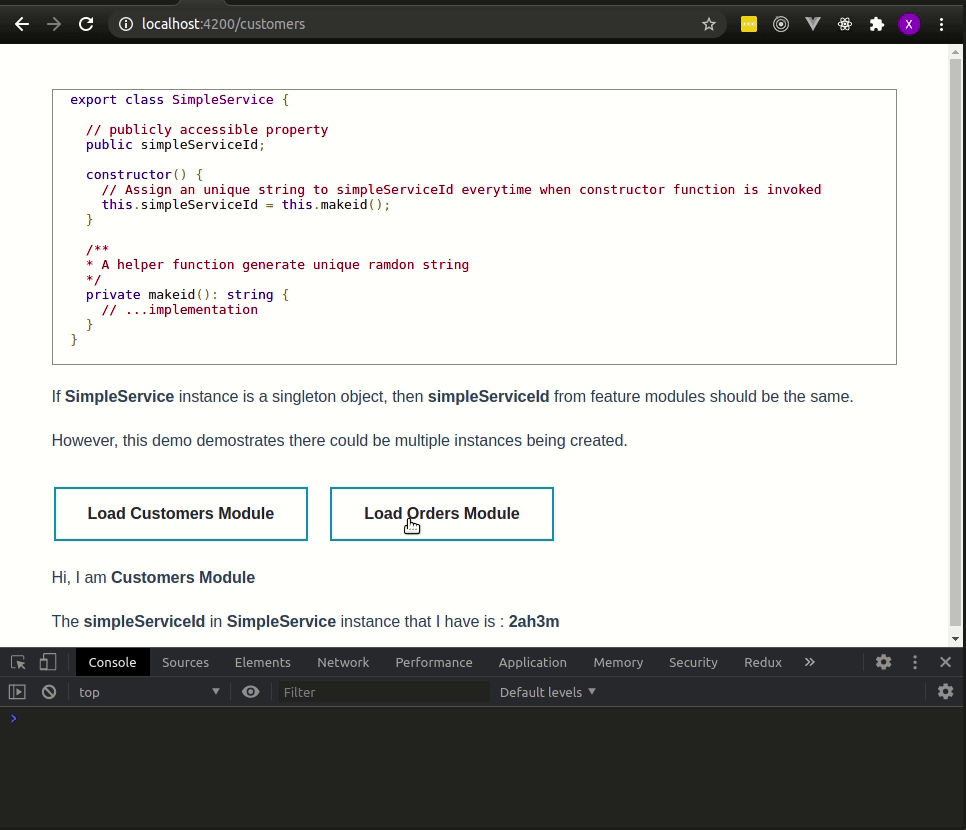

# Typescript Runtime Singleton Checker
Singleton services are becoming increasingly imperative when developing large-scale frontend applications. A very common use case would be maintaining a consisten rxjs subject (state) from a service class that will be used by multiple pages (some are eager loaded while some are lazy loaded).
Accidently creating multiple instances from the same service class will certainly break pre-defined consistent state across different pages.

This tool is a Typescript class decorator which can be easily applied to the class that you want its instance to be created only once and subsequently used as a singleton object during runtime.
This decorator acts as an observer of the class's constructor. When the class constructor is invoked more than once during runtime, it will print a console warning message which will
help you to checkout why multiple instances are created from a given class.
## Demo

## Installation
```js
npm install singleton-checker
yarn add singleton-checker
```
## Usage

```js
import { singletonChecker } from 'singleton-checker';

@singletonChecker
class SampleService {}
```
## Outcome
When multiple instances are created from "SampleService" class in runtime, a warning message will be printed in console

```js
🔥 RUNTIME Singleton Checker: class SimpleService now has 2 instances running!
```
License
----

See the [LICENSE](LICENSE.md) file for license rights and limitations (MIT).
